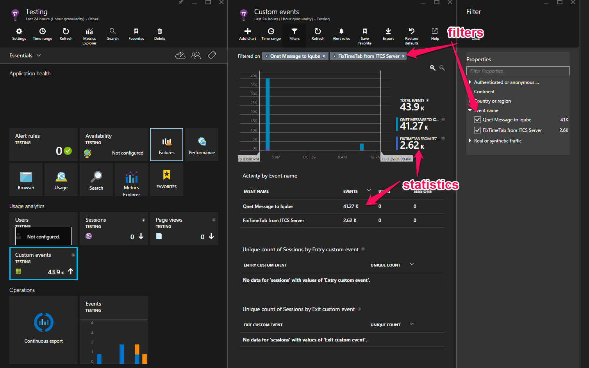

## Application Insights in Gorba Products ##

**Proof of concept report**
## Sumary
### What is Application Inisghts? ###

Application Insights is an extensible analytics service that monitors your live application. It helps you detect and diagnose performance issues, and understand what users actually do with your app. It's designed for developers, to help you continuously improve the performance and usability of your app.

# How it works #


The SDK has several modules which collect telemetry, for example to count users, sessions, and performance. You can also write your own custom code to send telemetry data to the portal. Custom telemetry is particularly useful to trace user stories: you can count events such as button clicks, achievement of particular goals, or user mistakes.

### Platforms and languages ###
**There are SDKs for a growing range of platforms. Currently the list includes:**

- ASP.NET servers on Azure or your IIS server
- Azure Cloud Services
- J2EE servers
- Web pages: HTML+JavaScript
- Windows Phone, Windows Store, Windows 10 universal apps, and direct integration with the Windows - - 10 developer portal
- Windows desktop
- iOS
- Android
- Other platforms - Node.js, PHP, Python, Ruby, Joomla, SharePoint, WordPress

### Limits ###
**There are some limits on the number of metrics and events per application.**

 - Up to **500** telemetry data points **per second** per instrumentation key (that is, **per application**). This includes both the standard telemetry sent by the SDK modules, and custom events, metrics and other telemetry sent by your code.
- Maximum of **200** unique metric names and **200** unique property names for your application. Metrics include data send via TrackMetric as well as measurements on other data types such as Events. Metrics and property names are global per instrumentation key, not scoped to data type.
- **Properties** can be used for **filtering** and group-by only while they have **less than 100 unique values** for **each property**. After the unique values exceed 100, the property **can still** be used for **search** and filtering but no longer for filters.
- Standard properties such as Request Name and Page URL are limited to 1000 unique values per week. - After 1000 unique values, additional values are marked as "Other values". The original value can still be used for full text search and filtering.
### Pricing ###
[Pricing](https://azure.microsoft.com/en-us/pricing/details/application-insights/)

### Is it usefull for our purposes? ###

***+ Advantages:***

- In general its really usefull to get informations about usage and behavior from our customers.
- It doesn't requires too much resources, so its also usefull for units.
- Its cheap in development and later in operation compared to a solution with Eventhubs.
- Possibility of sending seperate Properties and Metrics as Dictionaries, instead of sending texts which is hard to filter later on.

***- Disadvantages:***

- Limited amount of messages, in case of the ITCS System with about 2.5 mio message per day.
- The filter funktion is only available if there are less then 100 unique values. 
It's in case of the ITCS System too less either. Because there are way more AzbId's and LineId's.

 

# API Documentation #

### Persistence Channel (e.g for Units) ###
[Link to MS Page](https://azure.microsoft.com/en-us/documentation/articles/app-insights-windows-desktop/#persistence-channel)

If your app runs where the internet connection is not always available or slow, consider using the persistence channel instead of the default in-memory channel.

The default in-memory channel loses any telemetry that has not been sent by the time the app closes. Although you can use Flush() to attempt to send any data remaining in the buffer, it will still lose data if there is a no internet connection, or if the app shuts down before transmission is complete.

By contrast, the persistence channel buffers telemetry in a file, before sending it to the portal. `Flush()` ensures that data is stored in the file. If any data is not sent by the time the app closes, it will remain in the file. When the app restarts, the data will be sent then, if there is an internet connection. Data will accumulate in the file for as long as is necessary until a connection is available.


# Custom Events
You can attach properties and measurements to your events (and also to metrics, page views, exceptions, and other telemetry data).

***Properties*** are string values that you can use to filter your telemetry in the usage reports. For example if your app provides several games, you'll want to attach the name of the game to each event, so that you can see which games are more popular.

There's a limit of about 1k on the string length. (If you want to send large chunks of data, use the message parameter of TrackTrace.)

***Metrics*** are numeric values that can be presented graphically. For example, you might want to see if there's a gradual increase in the scores your gamers achieve. The graphs can be segmented by the properties sent with the event, so that you could get separate or stacked graphs for different games.

Metric values should be >= 0 to be correctly displayed.

```
// Set up some properties and metrics:
var properties = new Dictionary <string, string> 
   {{"game", currentGame.Name}, {"difficulty", currentGame.Difficulty}};
var metrics = new Dictionary <string, double>
   {{"Score", currentGame.Score}, {"Opponents", currentGame.OpponentCount}};

// Send the event:
telemetry.TrackEvent("WinGame", properties, metrics);
```
### Outputting Real-Time Stream Analytics data to a Power BI Dashboard ###

[Link to MSDN article](http://blogs.msdn.com/b/powerbidev/archive/2015/04/28/outputting-real-time-stream-analytics-data-to-a-power-bi-dashboard.aspx)


[Sample with Realtime Twitter analytics](http://www.jenunderwood.com/2015/10/12/real-time-analytics-with-azure-and-power-bi/)


The same you can do with Application Insights where you can do a continous export to a blob storage. From this blob storage can be used as an input in a Stream Analytics Job. At the end you can attach a PowerBI dashboard on the output of this Stream Analytics Job.

## Possible integrations to existing software solutions ##

### Application Insights NLog Target ###

Application Insights NLog Target is a custom target allowing you to send NLog log messages to Application Insights. Application Insights will collect your logs from multiple sources and provide rich powerful search capabilities. Data which is produced is not filterable in azure portal. It's more just a temporary solution, to collect logs on a central server. It ***requires  NLog > 2.1.0***. The implemented version in our products is 2.0.0.

[Nuget Packet Link](https://www.nuget.org/packages/Microsoft.ApplicationInsights.NLogTarget/0.12.0-build17386)


## Spike with Application Insights and Comms ITCS Client emulation 


***Diagramm of messageflow in spike***


***Screenshot of Azure Application Insights Dashboard***



